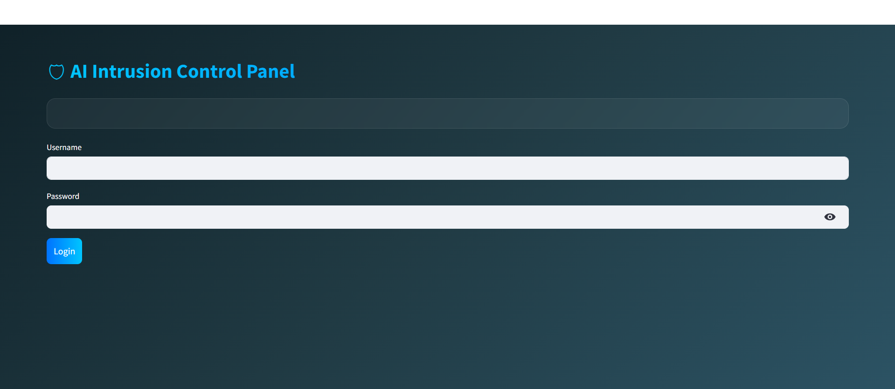
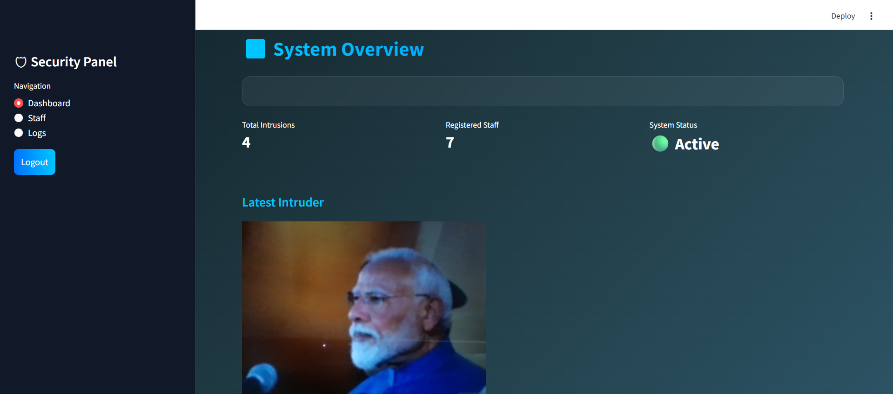
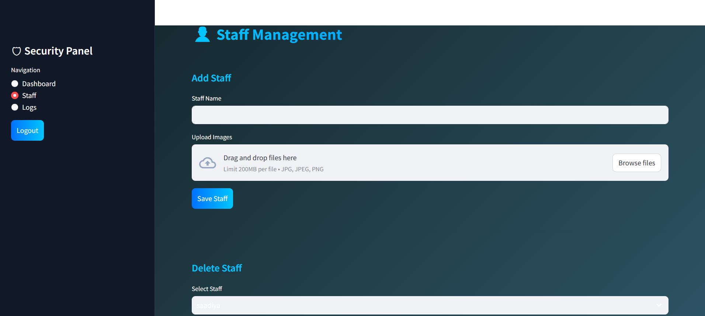
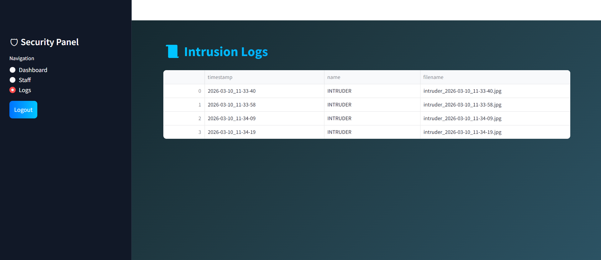

# 🛡️ AI Intrusion Detection System

An AI-powered surveillance system that detects unauthorized individuals using **face recognition**.  
The system automatically identifies intruders in real time, triggers an **alarm**, captures the intruder image, sends an **email alert**, and provides a **Streamlit-based admin dashboard** for monitoring and managing authorized personnel.

This project demonstrates the integration of **Artificial Intelligence, Computer Vision, and Web Dashboard technologies** to build a smart security monitoring system.

---

# 🚀 Features

• Real-time face recognition using DeepFace and OpenCV  
• Automatic intruder detection  
• Alarm trigger when an unauthorized person is detected  
• Intruder image capture and logging  
• Email alert with captured intruder image  
• Admin dashboard for system monitoring  
• Staff management system to register authorized users  
• Intrusion logs with timestamps and images  

---

# 🧠 Technologies Used

- Python  
- OpenCV  
- DeepFace  
- NumPy  
- Streamlit  
- SMTP (Email Notification)  
- Computer Vision  

---

# ⚙️ System Workflow

1️⃣ Capture images of authorized users using the dataset script  

2️⃣ Generate face embeddings for recognition  

3️⃣ Start the intrusion detection system  

4️⃣ When an intruder appears:
- The system detects the face
- Compares it with stored embeddings
- If not recognized:
   - Alarm is triggered
   - Intruder image is saved
   - Email alert is sent

5️⃣ Administrator can monitor activity through the dashboard

---

# 🖥️ Admin Panel Screenshots

## 🔐 Admin Login

Administrator logs in to access the system control panel.

---

## 📊 Dashboard

The dashboard provides an overview of the system including:

- Total intrusions detected
- Number of registered staff
- System status

---

## 👤 Staff Management

Administrator can add or remove authorized staff members and update the face recognition dataset.

---

## 📜 Intrusion Logs

Displays a list of intruder detections with timestamps and captured images.

---

# 📂 Project Structure
AI-Intrusion-Detection-System
│
├── main.py # Runs the real-time intrusion detection system
├── alarm.py # Handles alarm sound when intruder detected
├── create_dataset.py # Captures images of authorized users
├── generate_embeddings.py # Generates facial embeddings for recognition
├── dashboard.py # Streamlit admin dashboard
│
├── dataset/ # Automatically created for storing authorized user images
│ └── authorized/
│
├── trainer/ # Stores generated embeddings
│ └── embeddings.pickle
│
├── logs/ # Stores intrusion logs and captured images
 ├── log.csv
 └── intruder_images/

Note:  
The **dataset**, **trainer**, and **logs** folders will be automatically created when running the system.

For privacy reasons, personal datasets and captured images are not included in this repository.

---

# ⚙️ Installation

Clone the repository
git clone https://github.com/sathvikareddy2/Intrusion_Detection.git
Navigate to the project folder
Install required dependencies
cd Intrusion_Detection

Install required dependencies

pip install -r requirements.txt

---

# ▶️ Usage

### Step 1: Capture Authorized User Images

python create_dataset.py

Enter the name of the person when prompted.  
The system will automatically capture and store images of the authorized user.

---

### Step 2: Generate Face Embeddings

python generate_embeddings.py

This will generate facial embeddings from the captured dataset.

---

### Step 3: Start the Intrusion Detection System

python main.py

The webcam will start and begin monitoring for unauthorized access.

---

### Step 4: Run the Admin Dashboard

streamlit run dashboard.py

Open the provided local URL in your browser to access the admin dashboard.

---

# 🔔 Intruder Detection Process

When an unknown person appears in front of the camera:

- The system detects the face using OpenCV
- Facial embeddings are generated using DeepFace
- The embedding is compared with stored authorized embeddings
- If the face is not recognized:
  - The person is labeled as **INTRUDER**
  - Alarm sound is triggered
  - Intruder image is captured
  - Event is logged with timestamp
  - Email alert is sent with the captured image

---

# 🔒 Privacy Notice

This repository does not include personal images or datasets to protect privacy.  
Users can generate their own dataset using the provided scripts.

---

# 📜 License

This project is licensed under the MIT License.

---

# 👨‍💻 Author

Chidipudi Sathvika 
